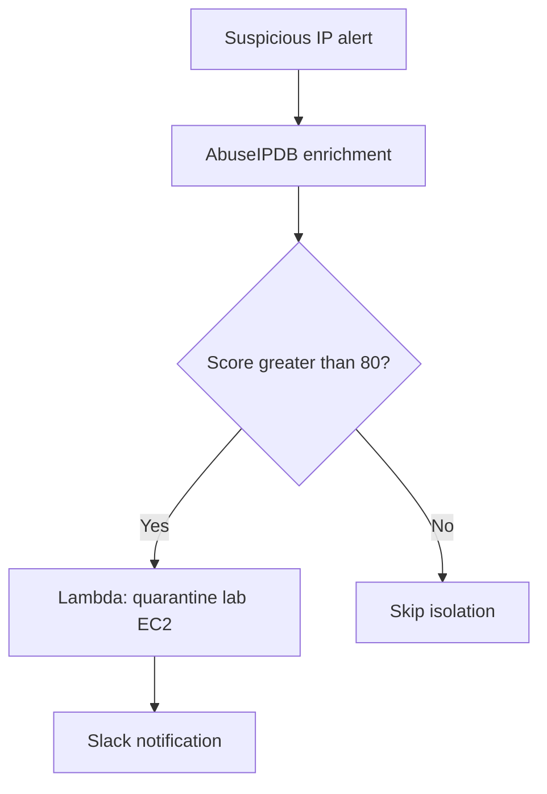

<!-- Profile README for MUSFIRA-ZAFAR/MUSFIRA-ZAFAR -->

<h1 align="center">Hi, I'm Musfira 👋</h1>

<strong>Aspiring SOC Analyst · Cybersecurity Practitioner · Blue Team</strong>

 &nbsp;  &nbsp; 

<a href="#about">About</a> · <a href="#projects">Projects</a> · <a href="#evidence">Evidence</a> · <a href="#skills">Skills</a> · <a href="#credentials">Credentials</a> · <a href="#direction">Goals</a> · <a href="#connect">Connect</a>

---

## 👩‍💻 Behind the Portfolio

I'm a cybersecurity practitioner from Multan, Pakistan, working toward my first **SOC Analyst / Cybersecurity Analyst role**. I completed an **EduQual Level 3 Diploma in Cloud Cyber Security with 91%** and earned the **Cybrixen Certified SOC Analyst (CCSA)** certification.

My interest is in understanding what happened behind an alert: which account was involved, what process ran, how the activity developed, and what evidence supports the next response step. My projects cover Windows endpoint monitoring, Splunk detections, malware behavior analysis, AWS log investigations, and automated containment.

**Splunk is my primary SIEM.** I also have project experience with Wazuh, Sysmon, Sigma, Chainsaw, Wireshark, AWS CloudTrail, Amazon Athena, and Shuffle.

I share my work through investigation reports, detection queries, screenshots, and troubleshooting notes so others can follow the reasoning and reproduce the labs.

<code>Build → Observe → Investigate → Detect → Validate → Document</code>

<table>
<tr>
<td width="25%" align="center"><strong>10</strong> Featured repositories</td>
<td width="25%" align="center"><strong>2</strong> Agent Tesla Sigma rules validated</td>
<td width="25%" align="center"><strong>6 / 356</strong> Key cloud incident events / logged actions</td>
<td width="25%" align="center"><strong>2 branches</strong> SOAR isolation and skip paths tested</td>
</tr>
</table>

<strong>📊 Portfolio snapshot — expand to see my areas of practical work</strong>

## 📌 Portfolio at a Glance

| Area | What I've built or investigated |
| --- | --- |
| **SOC monitoring** | Windows log collection, RDP brute-force detection, SPL searches, and Splunk dashboards |
| **Detection engineering** | Sigma rules validated against Sysmon logs, command-line hunting, and MITRE ATT&CK mapping |
| **Cloud security** | CloudTrail → S3 → Athena logging and SQL investigation of simulated IAM compromise |
| **Security automation** | Shuffle playbook connecting IP enrichment, conditional EC2 isolation, and Slack notification |
| **Network investigations** | Emotet traffic analysis, C2 identification, IOC extraction, and Windows attack investigations |
| **Security tooling** | Python web scanner with a CLI, Flask interface, and Markdown/PDF reporting |
| **Industrial security** | MQTT authentication and TLS, Node-RED monitoring, and Wazuh alerts in an Industry 4.0 demo |

## 🚀 Featured Projects

<table>
<tr>
<td width="50%" valign="top">
<h3>🦠 Agent Tesla Detection</h3>

Turned sandbox observations into persistence and C2 Sigma rules, validated using controlled reproductions.

<code>ANY.RUN · Sigma · Sysmon · Chainsaw</code>

<strong>Evidence:</strong> Two rules matched real endpoint telemetry.

<a href="https://github.com/MUSFIRA-ZAFAR/agenttesla-sigma-detection-lab"><strong>Explore project →</strong></a>

</td>
<td width="50%" valign="top">
<h3>☁️ Cloud Incident Investigation</h3>

Built cloud logging and investigated a simulated IAM compromise using raw CloudTrail evidence.

<code>CloudTrail · S3 · Athena SQL · IAM</code>

<strong>Evidence:</strong> Six key events reconstructed from 356 logged actions.

<a href="https://github.com/MUSFIRA-ZAFAR/secops-cloud-log-auditing"><strong>Explore project →</strong></a>

</td>
</tr>
<tr>
<td width="50%" valign="top">
<h3>⚙️ Automated Threat Isolation</h3>

Connected IP reputation enrichment to conditional quarantine of a lab EC2 instance and analyst notification.

<code>Shuffle · AbuseIPDB · Lambda · EC2</code>

<strong>Evidence:</strong> Low-score skip and high-score isolation paths verified.

<a href="https://github.com/MUSFIRA-ZAFAR/automated-IP-threat-isolation-playbook"><strong>Explore project →</strong></a>

</td>
<td width="50%" valign="top">
<h3>🔎 Splunk Endpoint Detection</h3>

Built Windows log forwarding, SPL detections, and a dashboard for RDP brute-force investigation.

<code>Splunk · SPL · Sysmon · Forwarder</code>

<strong>Evidence:</strong> 15 failed logons followed by one successful authentication.

<a href="https://github.com/MUSFIRA-ZAFAR/RDP-Brute-Force-Detection"><strong>Explore project →</strong></a>

</td>
</tr>
</table>

## 📁 More of My Work

| Project | What I did | Main tools |
| --- | --- | --- |
| [AD Kerberoasting Detection](https://github.com/MUSFIRA-ZAFAR/AD-Kerberoasting-Detection) | Built an AWS-hosted Samba AD lab, simulated Kerberoasting, investigated RC4 service-ticket requests in Samba logs, and documented response actions and a Sigma detection rule | Samba AD, Impacket, Kerberos tools, John the Ripper, Sigma |
| [FortifyWebX Scanner](https://github.com/MUSFIRA-ZAFAR/fortifywebx-scanner) | Built a crawler with five passive checks, severity scoring, CLI/web interfaces, and Markdown/PDF reports; tested with Juice Shop and DVWA | Python, Flask, Requests, BeautifulSoup, Docker |
| [SOC Investigations](https://github.com/MUSFIRA-ZAFAR/soc-investigations) | Investigated Emotet PCAP traffic, RDP brute-force activity, and Windows attack simulations; extracted IOCs and wrote investigation reports | Wireshark, VirusTotal, Event Viewer, Hydra |
| [Industry 4.0 Security](https://github.com/MUSFIRA-ZAFAR/Industry-4.0-Security) | Implemented MQTT authentication and TLS, built a sensor dashboard, and demonstrated Wazuh brute-force alerts with IEC 62443/NIST CSF mappings | Mosquitto, OpenSSL, Node-RED, Wazuh, Ubuntu |
| [Networking Notes](https://github.com/MUSFIRA-ZAFAR/networking-notes) | Documented networking fundamentals, protocols, subnetting, monitoring, and their relevance to SOC investigations | OSI/TCP-IP, DNS, DHCP, VLANs, VPNs, IDS/IPS |

## 🧪 Inside the Investigations

<strong>🦠 Agent Tesla — analysis, validation, and scope</strong>

[Explore the repository](https://github.com/MUSFIRA-ZAFAR/agenttesla-sigma-detection-lab)

- Analyzed an existing **ANY.RUN public sandbox report** to identify Agent Tesla scheduled-task persistence and SMTP-based C2 behavior.
- Extracted indicators and mapped findings to **T1053.005** and **T1071.003**.
- Wrote **two Sigma rules**: a behavior-based persistence rule and an indicator-based C2 rule.
- Reproduced the persistence pattern and a DNS lookup on an AWS Windows host, then confirmed both rules matched **real Sysmon logs using Chainsaw**.

**Scope:** validation used controlled behavior reproduction; the malware binary was not executed on the AWS host. The rules remain experimental.

<strong>☁️ AWS compromise — evidence and behavioral detections</strong>

[Explore the repository](https://github.com/MUSFIRA-ZAFAR/secops-cloud-log-auditing)

- Built a **CloudTrail → S3 → Amazon Athena** pipeline.
- Simulated compromised credentials, a login without MFA, IAM privilege escalation, and an unauthorized EC2 launch in my own lab account.
- Investigated the raw logs with SQL and reconstructed **six key events from 356 logged actions**.
- Added behavioral queries for self-escalation and baseline deviation, including review of legitimate activity flagged as anomalous.

<strong>⚙️ SOAR playbook — tested branches and lab boundaries</strong>

[Explore the repository](https://github.com/MUSFIRA-ZAFAR/automated-IP-threat-isolation-playbook)

- Built a **Shuffle → AbuseIPDB → AWS Lambda → EC2 quarantine → Slack** workflow.
- Used an abuse-confidence threshold **greater than 80** to trigger a security-group change on the lab instance.
- Verified both branches: low-score input skipped isolation; high-score input triggered isolation and notification.
- Documented troubleshooting and the authentication, IAM, and asset-mapping changes needed before production use.

<strong>🔎 Splunk labs — RDP correlation and command-line hunting</strong>

[RDP Brute-Force Detection](https://github.com/MUSFIRA-ZAFAR/RDP-Brute-Force-Detection) · [LotL Command-Line Hunting](https://github.com/MUSFIRA-ZAFAR/Lotl-command-line-hunting)

- Built a Windows-to-Splunk log pipeline using **Sysmon and Splunk Universal Forwarder**.
- Investigated **15 failed RDP logons followed by one successful authentication**, using Windows events **4625 and 4624**.
- Created SPL searches and a dashboard to show failed attempts and the subsequent successful logon.
- Captured the `vssadmin.exe delete shadows` command pattern with **Sysmon Event ID 1**, examined process context, and validated an SPL hunt against the ingested evidence.

<strong>🖼️ View Agent Tesla detection evidence</strong>

**Persistence rule:** Chainsaw match for the controlled scheduled-task reproduction.

**C2 indicator rule:** Chainsaw match for a DNS lookup of the analyzed indicator.

[Read the complete validation record](https://github.com/MUSFIRA-ZAFAR/agenttesla-sigma-detection-lab#-validation--proof-of-detection)

<strong>🧭 View the SOAR playbook decision flow</strong>

This diagram represents the individual IP threat isolation lab.

## 🛠️ Technical Toolkit

**SIEM & Detection**

 &nbsp;
 &nbsp;
 &nbsp;
 &nbsp;

**Cloud & Automation**

 &nbsp;
 &nbsp;
 &nbsp;
 &nbsp;
 &nbsp;

**Investigation & Development**

 &nbsp;
 &nbsp;
 &nbsp;
 &nbsp;

<strong>📋 Expand the skills and practical experience matrix</strong>

| Domain | Tools and practical experience |
| --- | --- |
| **SIEM & log analysis** | Splunk Enterprise, SPL, Universal Forwarder, dashboards, Windows Event Logs; Wazuh project experience |
| **Endpoint detection** | Sysmon, Event Viewer, Sigma, Chainsaw, process lineage and command-line analysis |
| **Threat intelligence** | ANY.RUN report analysis, VirusTotal, AbuseIPDB, IOC extraction and MITRE ATT&CK mapping |
| **Cloud security** | AWS EC2, IAM, security groups, CloudTrail, S3, Athena SQL and Lambda |
| **Automation & scripting** | Shuffle workflows, API integration, Python, boto3, Flask; Bash fundamentals |
| **Networking & systems** | Wireshark, TCP/IP, DNS, Linux/Ubuntu, Windows Server, VirtualBox and Docker |
| **Security testing** | Nmap, Hydra, Impacket, DVWA and OWASP Juice Shop in authorized labs |
| **Reporting** | Incident timelines, detection documentation, screenshots, troubleshooting and remediation recommendations |

## 🎓 Education & Certification

 &nbsp; 

| Qualification | Achievement |
| --- | --- |
| **EduQual Level 3 Diploma in Cloud Cyber Security** | Al Nafi International College · **91%** |
| **Cybrixen Certified SOC Analyst (CCSA)** | Practical SIEM/EDR assessment: investigations, alert correlation, timelines, true/false positives, and escalation |
| **FSc · 2024** | **89.583%** |
| **Student of the Year** | Awarded by my FSc college |

## 💼 Experience & Community

**FortifyWebX — Cybersecurity Internship · July–September 2026**  
Completed practical assignments involving reconnaissance, vulnerability assessment, Linux/Windows security testing, web application testing, scanner development, and technical reporting.

**Cybrixen — Ambassador**  
Refer interested learners to Cybrixen and share cybersecurity learning opportunities through professional outreach.

**Pakistan Network Solutions (PakNS) — Freelance Business Development Specialist**  
Support outreach for cybersecurity consultancy and PECB professional training. This role is helping me develop communication skills and understand organizational security and training needs.

## 🎯 Goals & Next Steps

My immediate goal is to join a team as an **entry-level SOC Analyst or Cybersecurity Analyst**, where I can contribute to monitoring, investigation, and clear incident documentation while learning from experienced analysts. I'm open to **remote opportunities that accept candidates based in Pakistan**.

My next steps are to:

- Deepen my Splunk skills in alert correlation, detection tuning, and false-positive analysis.
- Expand investigations across endpoint, network, and cloud evidence.
- Improve Python/Bash scripting and Linux administration.
- Strengthen automation with authentication, least-privilege access, reliable asset mapping, and analyst approval where appropriate.
- Explore AI-assisted SOC workflows for enrichment and investigation summaries while keeping decisions grounded in evidence.

Longer term, I plan to pursue a **BS in Computer Science** and grow into detection engineering and cloud security. I want to build useful security tools and detections that help analysts understand threats and respond with confidence.

## 📈 GitHub Activity

 &nbsp; 

<strong>🗓️ Explore recent project updates and contributions</strong>

| Project | Latest repository commit |
| --- | --- |
| [Agent Tesla detection lab](https://github.com/MUSFIRA-ZAFAR/agenttesla-sigma-detection-lab/commits) |  |
| [Cloud log auditing](https://github.com/MUSFIRA-ZAFAR/secops-cloud-log-auditing/commits) |  |
| [IP isolation playbook](https://github.com/MUSFIRA-ZAFAR/automated-IP-threat-isolation-playbook/commits) |  |

[View my contribution calendar on GitHub](https://github.com/MUSFIRA-ZAFAR) · [Browse all repositories](https://github.com/MUSFIRA-ZAFAR?tab=repositories)

## 🤝 Let's Connect

I'm interested in **blue-team collaboration, detection engineering, cloud investigations, and entry-level security opportunities**.

 &nbsp; 

Based in Pakistan · Open to remote opportunities accepting candidates in Pakistan

---

<em>Build the environment. Follow the evidence. Validate the detection. Share the learning.</em>

<a href="#about">↑ Back to top</a>

